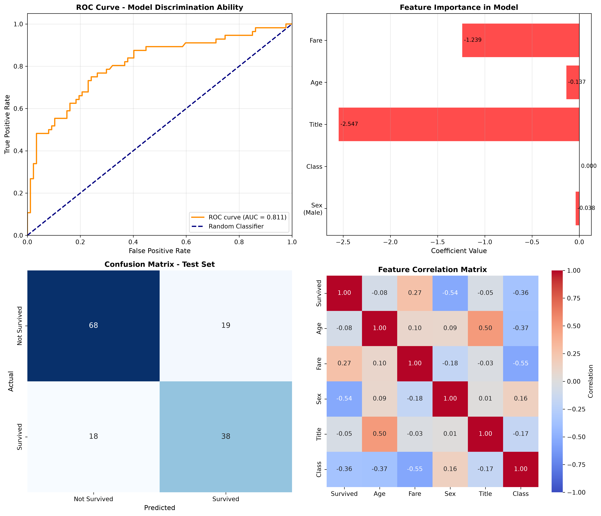

# Titanic Data Analysis

## Overview

A comprehensive exploratory and predictive data analysis of the Titanic dataset, investigating passenger survival patterns through statistical testing, feature engineering, and machine learning. This project demonstrates rigorous analytical methodology with statistical validation of findings.

## Dataset

- **Source:** [Kaggle - Titanic: Machine Learning from Disaster](https://www.kaggle.com/competitions/titanic/data)
- **Train set:** 891 passengers with 12 features
- **Test set:** 418 passengers for prediction
- **Analysis set:** 714 passengers (after removing missing values)
- **Files:** data/train.csv, data/test.csv

## Key Findings

### 1. Gender Impact - Statistically Significant

**Chi-Square Test Results:**
- Chi-square statistic: 260.72 (p < 0.001)
- Female survival rate: 74.2% (95% CI: 69.43% - 78.98%)
- Male survival rate: 18.9% (95% CI: 15.77% - 22.18%)
- **Conclusion:** Gender was the strongest predictor of survival. The difference is extremely statistically significant (p < 0.001), with confidence intervals that don't overlap.

### 2. Age Impact - Statistically Significant

**T-Test Results:**
- Survivors averaged 28.34 years old
- Non-survivors averaged 30.63 years old
- T-statistic: -2.067, p = 0.039
- Age difference: 2.28 years (survivors were younger)
- **Conclusion:** Age significantly affected survival, with younger passengers having better odds.

### 3. Social Status (Title) Impact - Highly Significant

**Chi-Square Test Results:**
- Chi-square statistic: 283.31 (p < 0.001)

Survival rates by passenger title:
- Mrs (married women): 79.2%
- Miss (unmarried women): 69.8%
- Master (young boys): 57.5%
- Mr (men): 15.7%
- Other (rare titles): 44.4%

**Conclusion:** Social status, indicated by title, was highly significant for predicting survival.

### 4. Wealth (Fare) Impact - Statistically Significant

**T-Test Results:**
- Survivors paid average fare: $48.40
- Non-survivors paid average fare: $22.12
- Difference: $26.28 (highly significant, p < 0.001)

Survival by wealth category:
- Upper class (high fare): 58.1%
- Middle class: 44.5%
- Lower-middle class: 30.9%
- Poor (low fare): 20.7%

**Conclusion:** Wealth, proxied by ticket fare, was a significant predictor of survival.

### 5. Predictive Model Performance

**Logistic Regression Model Results:**
- Training Accuracy: 81.26%
- Test Accuracy: 74.13%
- Test ROC-AUC: 0.8106
- Test Precision: 66.67%
- Test Recall: 67.86%

**Feature Importance (by coefficient magnitude):**
1. Sex (Male=1): -2.546 (being male decreased survival probability dramatically)
2. Passenger Class: -1.239 (lower class decreased survival probability)
3. Title: -0.137 (certain titles decreased survival probability)
4. Age: -0.038 (older age decreased survival probability slightly)
5. Fare: +0.0001 (higher fare increased survival probability, minimal effect)

**Conclusion:** The logistic regression model successfully predicts survival with 74% accuracy on unseen data. Being male was by far the strongest negative predictor, followed by lower passenger class.

## Statistical Methodology

### Hypothesis Testing
- Chi-square tests for categorical independence (gender, title, survival)
- Independent t-tests for continuous variables (age, fare vs survival)
- 95% confidence intervals for survival rate estimates
- All p-values < 0.05 considered statistically significant

### Feature Engineering
- Extracted titles from passenger names to proxy social status
- Created wealth categories based on ticket fare quartiles
- Grouped rare titles to avoid sparse categories
- All engineered features tested for statistical significance

### Model Validation
- 80/20 train-test split with random_state=42 for reproducibility
- Logistic regression chosen for interpretability
- Model evaluated on multiple metrics: accuracy, precision, recall, ROC-AUC
- Confusion matrix analyzed to understand prediction patterns

## Visualizations

**Chart Breakdown:**
1. **ROC Curve (top-left):** Shows model's ability to discriminate between survivors and non-survivors. AUC of 0.81 indicates good predictive power.
2. **Feature Importance (top-right):** Displays coefficient values for each feature. Negative values decrease survival probability; positive increase it.
3. **Confusion Matrix (bottom-left):** Shows prediction accuracy breakdown on test set. 68 correct non-survivor predictions, 38 correct survivor predictions.
4. **Correlation Heatmap (bottom-right):** Displays correlations between all features. Sex shows strongest correlation with survival (r ≈ -0.54).

## Assumptions and Limitations

- **Missing Data:** Analysis excluded 177 passengers with missing age data and 687 with missing cabin data. This could bias age-based conclusions toward younger passengers who were more likely to have recorded ages.
- **Causality:** Statistical associations don't imply causation. Gender didn't "cause" survival; rather, evacuation protocols prioritized women.
- **Model Generalization:** Model trained on 1912 Titanic data. Results may not generalize to modern disasters with different evacuation procedures.
- **Class Imbalance:** Survivors (n=342) and non-survivors (n=549) are imbalanced, which could affect model predictions for minority class.

## Files in This Repository

- `notebooks/titanic_analysis.ipynb` - Complete analysis notebook with all code, statistical tests, feature engineering, and model development
- `data/train.csv` - Training dataset (891 passengers)
- `data/test.csv` - Test dataset (418 passengers)
- `results/titanic_model_analysis.png` - Four-panel visualization (ROC curve, feature importance, confusion matrix, correlation heatmap)
- `README.md` - This file

## Lessons Learned

1. **Statistical rigor matters:** Observations must be validated with statistical tests. What looks like a difference could be random chance.
2. **Multiple predictors interact:** Gender was the strongest predictor, but age, class, and wealth also mattered. Multivariate analysis reveals patterns single-variable analysis misses.
3. **Context is crucial:** Understanding historical context (women and children first policy) helps interpret statistical findings.
4. **Model performance depends on features:** Good feature engineering (extracting title, creating wealth proxy) improved model interpretability and accuracy.
5. **Always validate on test data:** Training accuracy (81%) was higher than test accuracy (74%), a common pattern showing models can overfit to training data.

## Tools and Libraries

- Python 3.12
- pandas - Data manipulation and analysis
- NumPy - Numerical computing
- Matplotlib & Seaborn - Data visualization
- scikit-learn - Statistical learning and model evaluation
- scipy.stats - Statistical testing

## Author

Anupriya Singh

## License

This project uses publicly available data from Kaggle and is for educational purposes.
